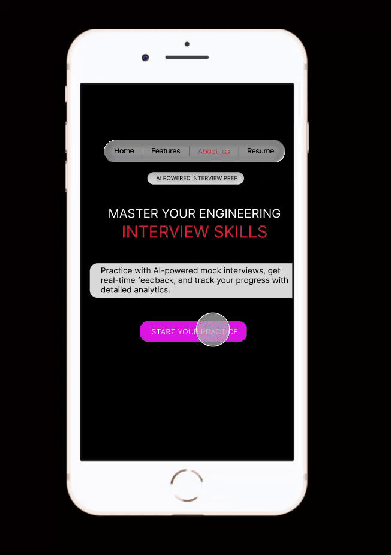

<p align="center">
  
</p>

<h1 align="center">🎯 InterviewAce</h1>

<p align="center">
  <b>AI-powered interview preparation platform for engineering students and companies.</b>
</p>

<p align="center">
  
  
  
  
</p>

---

## 🚀 About InterviewAce

InterviewAce is an **AI-driven mock interview system** built using **Streamlit**, designed to help engineering students practice interviews, receive AI-powered feedback, built their own **Resume** and download their full reports — including **text, audio, and video responses**.

Companies can also generate custom interview questions using AI.

---

## ⭐ Key Features

## 🔹 For Students
- 🎤 **AI-powered mock interviews**
- ✍️ Supports text, audio, and video responses
- 🤖 Real-time AI feedback with improvement suggestions
- 📄 Download full interview + analysis + Resume as **PDF**
- 🎓 Career & interview-type based question generation
- 👤 User registration and login system

## 🔹 For Companies
- 🧠 AI-based interview question generator
- 📚 Difficulty-based filtering (Basic → Advanced)
- 🏢 Company account system

## 🔹 UI & Experience
- 🎨 Smooth gradient UI with branding
- 🧭 Multi-page navigation (Home, Features, About)
- 🔐 Secure session handling

---

## 🧰 Tech Stack

| Component | Technology |
|----------|------------|
| Frontend | Streamlit |
| Backend | Python |
| Database | SQLite |
| AI Model | Ollama |
| PDF Engine | FPDF |
| API Handling | Requests |

---


---

## ⚙️ Installation

## **1️⃣ Clone the repo**
```bash
git clone https://github.com/nitintiwari5002/InterviewAce.git
cd InterviewAce
```

## **2️⃣ Install dependencies**
```bash
pip install -r requirements.txt
```

Or manually:
```bash
pip install streamlit requests fpdf
```
## **3️⃣ Install and run Ollama**

Download from → https://ollama.com

Pull a model (example):
```bash
ollama pull phi3:mini
```
## **4️⃣ Run the application**
```bash
streamlit run app.py
```


## **🌐 Environment Requirements**

- Python 3.9+

- Ollama installed and running locally at:
```bash
http://localhost:11434
```

- Stable internet connection (optional for updates)

## 🎥 Prototype Demo
[](https://github.com/nitintiwari5002/InterviewAce/raw/main/Recording%202026-01-04%20211122.mp4)

---



## 📸 Screenshots

## 🏠 Home Page


---


---


## 🎤 Mock Interview Interface


---


## 📊 AI Feedback & Analysis


## 🧭 Company interview questions


---


## 📑Resume


---


---


---


---

## **🛠️ Future Enhancements**

- Cloud-based progress tracking

- Company candidate dashboard

- Global performance statistics

## **🤝 Contributing**

Contributions are welcome!

- Fork this repo

- Create a new branch

- Make changes

- Open a pull request

## **📄 License**

This project is licensed under the MIT License.

### **❤️ Credits**

Built with passion by a team of engineers & educators dedicated to helping students succeed.
